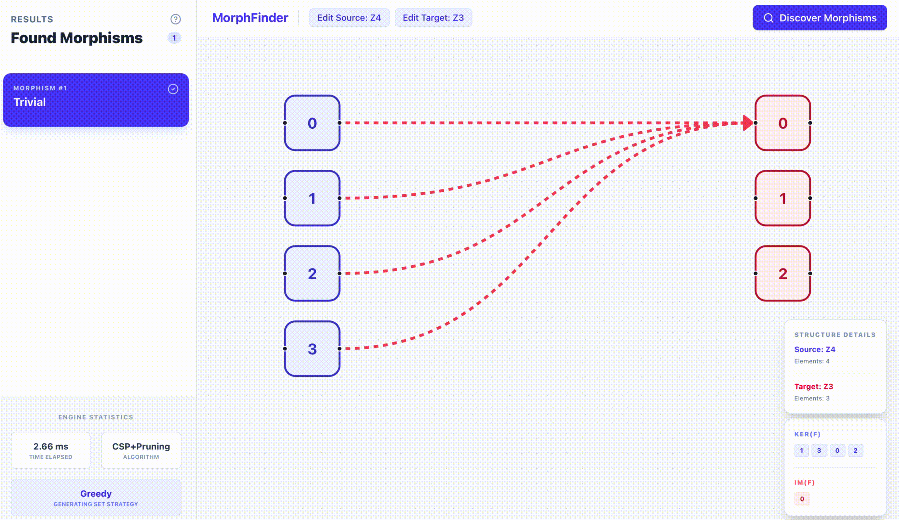

# MorphFinder

MorphFinder is a computational tool for finding and classifying homomorphisms between finite algebraic structures (magmas, semigroups, monoids, groups, rings, and fields) using an optimized CSP-based engine.

## Project Structure

The project is organized as follows:

- `backend`: directory containing FastAPI service, the algebraic engine and search logic.
- `frontend`: directory containing React + Vite application for interactive visualization of morphisms between magmas, semigroups, monoids,
  and groups.

## Quick Start

The easiest way to run MorphFinder is using Docker Compose. This will start both the backend API and the frontend
dashboard.

```bash
docker-compose up --build
```

- Frontend UI: http://localhost:5173
- Backend API: http://localhost:8000

## Usage

You can choose to use MorphFinder either from a Web UI or the Python API.

### Web UI



> **Note:** The Web UI is currently limited to magmas, semigroups, monoids, and groups. To analyze rings and fields,
> please use the Python API.

The Web UI provides an interactive way to discover and visualize morphisms between algebraic structures:

1. Add Structures: Click "+ Add Source" or "+ Add Target" to open the Structure Builder.
2. Define Structure:
    - Define the elements (e.g., `0, 1, 2, 3` or `a, b, c`).
    - Define a binary operation: either fill the Cayley's Table or specify the Formula (e.g., `(a + b) % n`)
3. Find Morphisms: Once both Source and Target are defined, click the Search icon to initiate the computation.
4. Visualize Results:
    - The Sidebar will display all discovered homomorphisms.
    - Click on a specific homomorphism in the sidebar to view its mapping, image, kernel, and algebraic properties in
      the central and right canvas.

### Python API

You can use the core library directly within the `backend/` directory:

```python3
from src.domain.entities.algebras.group import Group
from src.application.use_cases.find_homomorphisms import FindHomomorphismsUseCase

# Defining (Z4, +) and (Z3, +)
Z4 = Group({0, 1, 2, 3}, lambda a, b: (a + b) % 4)
Z3 = Group({0, 1, 2}, lambda a, b: (a + b) % 3)

# Find Hom(Z4, Z3)
use_case = FindHomomorphismsUseCase()
homomorphisms = use_case.execute(Z4, Z3)

# f: {0, 1, 2, 3} → {0, 1, 2} | 0 ↦ 0, 1 ↦ 0, 2 ↦ 0, 3 ↦ 0 
# Properties: Trivial | Ker(f): {0, 1, 2, 3} | Im(f): {0}
for hom in homomorphisms:
    print(hom.pretty())
```

<!--
## Manual Installation

If you prefer to run the components separately:

### Backend
```bash
cd backend
python3 -m venv .venv
source .venv/bin/activate
pip install -r requirements.txt
uvicorn src.infrastructure.api.main:app --reload
```

### Frontend
```bash
cd frontend
npm install
npm run dev
```

-->

## Running Tests

To run the backend test suite:

```bash
cd backend
pytest
```

## Theoretical Background

For an in-depth explanation of the mathematical foundations, the CSP search algorithm, and the classification of
homomorphisms, consult the [THEORY.md](THEORY.md) file.

## System Design

MorphFinder is built implementing Robert C. Martin's [Clean Architecture](https://blog.cleancoder.com/uncle-bob/2012/08/13/the-clean-architecture.html) principles to ensure that the core algebraic domain logic is decoupled from external frameworks like FastAPI and React. For a detailed breakdown of the architectural layers, the Dependency Rule, and the benefits of this design, please refer to the [SYSTEM-DESIGN.md](SYSTEM-DESIGN.md) file.