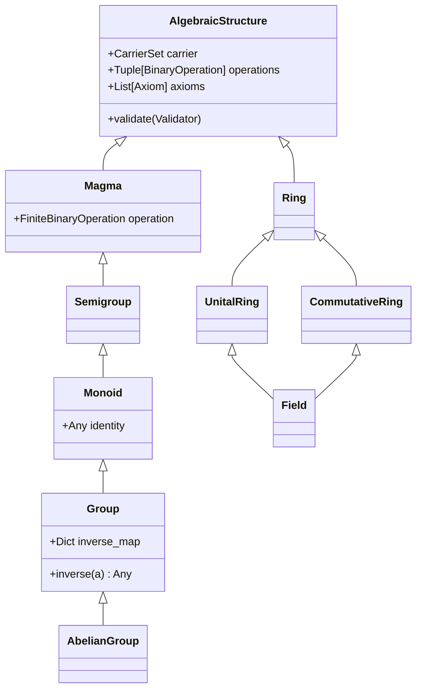
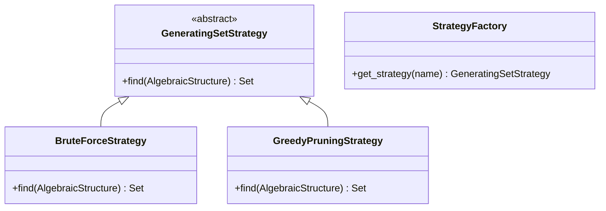
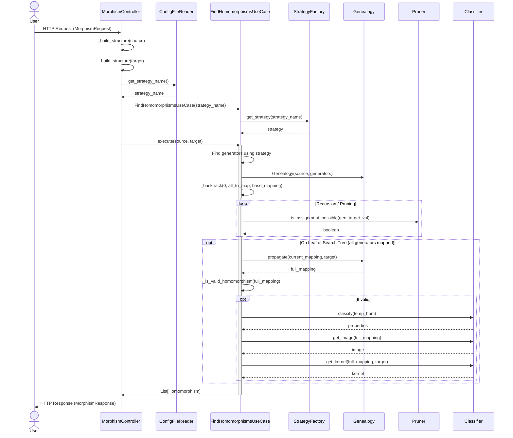
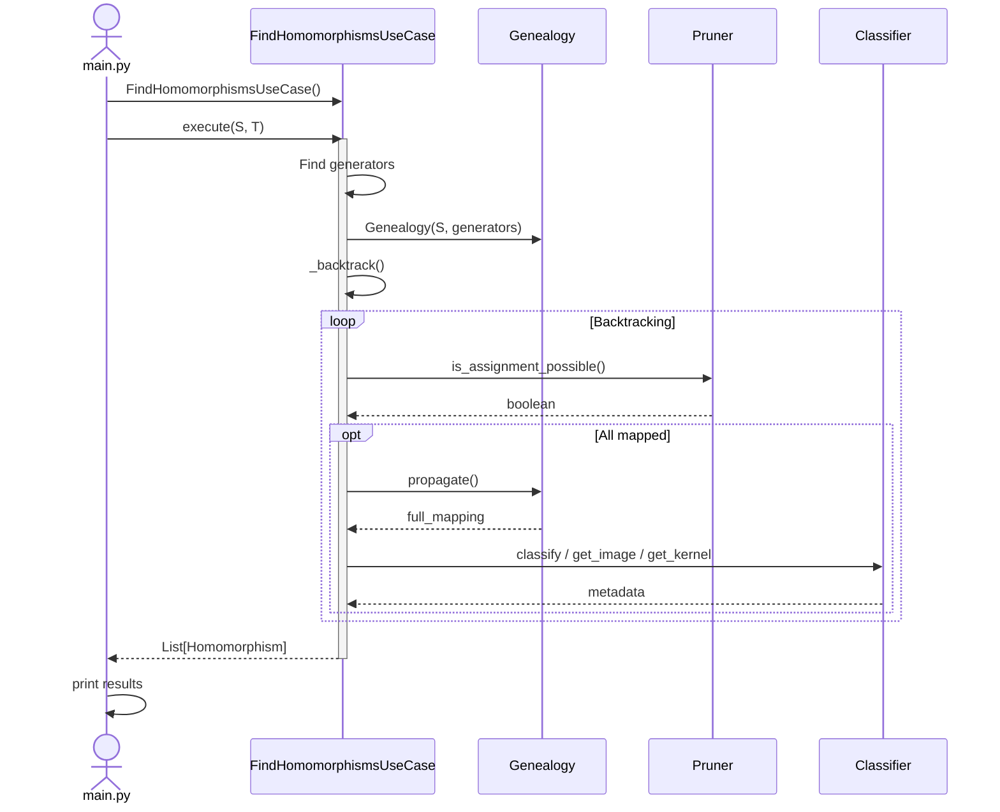

# System Design: MorphFinder Architecture

MorphFinder is designed according to Robert C. Martin's Clean Architecture principles. The primary goal is the Separation of Concerns, ensuring that the core algebraic domain logic is decoupled from external frameworks, UIs, and technical details.

## The Dependency Rule

The overriding rule that makes this architecture work is the Dependency Rule. This rule says that source code dependencies can only point inward. Nothing in an inner circle can know anything at all about something in an outer circle.

## The Four Layers

### 1. Entities (Domain Layer)
Path: `backend/src/domain/entities/`

This is the innermost layer. It contains the most general and high-level rules of the application - the Algebraic Domain.

- Algebras: Concrete definitions of `Group`, `Ring`, `Field`, etc. (located in `algebras/`).
- Axioms: Mathematical rules like Associativity or Commutativity.
- Value Objects: Pure data carriers like `CarrierSet`, `BinaryOperation`, and `Homomorphism`.
- Foundations: The base `AlgebraicStructure` and finite analysis tools.

### 2. Use Cases (Application Layer)
Path: `backend/src/application/`

This layer contains application-specific business rules. It orchestrates the flow of data to and from the entities.

- `FindHomomorphismsUseCase`: The primary use case that executes the discovery algorithm.
- `Generators`: Strategies for finding minimal generating sets (Brute Force, Greedy), which support the use cases.

### 3. Interface Adapters
Path: `backend/src/adapters/`

This layer consists of a set of adapters that convert data from the format most convenient for the use cases and entities, to the format most convenient for some external agency such as the Web or a Database.

- Controllers: `MorphismController` translates API requests into use case inputs and orchestrates the response.
- Gateways: `ConfigFileReader` provides an interface to external configuration files.
- Data Transfer Objects (DTOs): Pydantic schemas that define the API's contract.

### 4. Frameworks & Drivers (Infrastructure Layer)
Path: `backend/src/infrastructure/`

The outermost layer is generally composed of frameworks and tools such as the Database, the Web Framework, etc.

- FastAPI: The web framework used to expose the discovery engine as a REST API.
- Docker: Containerization and orchestration for the full-stack environment.
- Web UI: The React/TypeScript frontend (located in the `frontend/` directory).

## Benefits of this Design

1. Independent of Frameworks: The algebraic engine doesn't depend on FastAPI or any other library.
2. Testable: The domain logic can be tested without the UI, Database, or Web Server.
3. Independent of UI: The React frontend can be swapped for a CLI or a mobile app without changing the core logic.
4. Flexible Configuration: The way we load strategies (YAML, Env, Database) can change without affecting the application rules.

## Domain Modeling and Axiom Validation

### Algebra Hierarchy
The domain layer models finite algebraic structures using object-oriented inheritance to mirror mathematical categorization:

### Axiom Validation Design
When a concrete algebra (e.g., `Group`) is instantiated, it automatically appends its required axioms (e.g., `AssociativityAxiom`, `IdentityExistenceAxiom`, `InverseExistenceAxiom`) and validates them against the provided operations using the `FiniteAxiomValidator` (Domain Service). 

If any axiom check fails, a `ValueError` is raised, preventing the construction of mathematically invalid structures.

## Generating Set Discovery (Strategy Pattern)

To optimize backtracking, the search space is restricted from $O(|T|^{|S|})$ to $O(|T|^{|G|})$ by discovering a generating set $G$ of the source structure. MorphFinder employs the Strategy Pattern to decouple the discovery method from the main usecase:

* BruteForceStrategy: Finds the globally minimal generating set by checking all subsets in increasing size.
* GreedyPruningStrategy: Greedily accumulates elements to maximize closure size, then prunes redundant elements. Faster for larger structures but doesn't guarantee global minimality.

## Sequence Diagrams

### Web UI
This flow shows how the system handles HTTP requests from the frontend, involving data conversion and DTOs.

### Python API
This flow demonstrates how the application can be used directly, bypassing the Controller and DTO layers for programmatic access.

