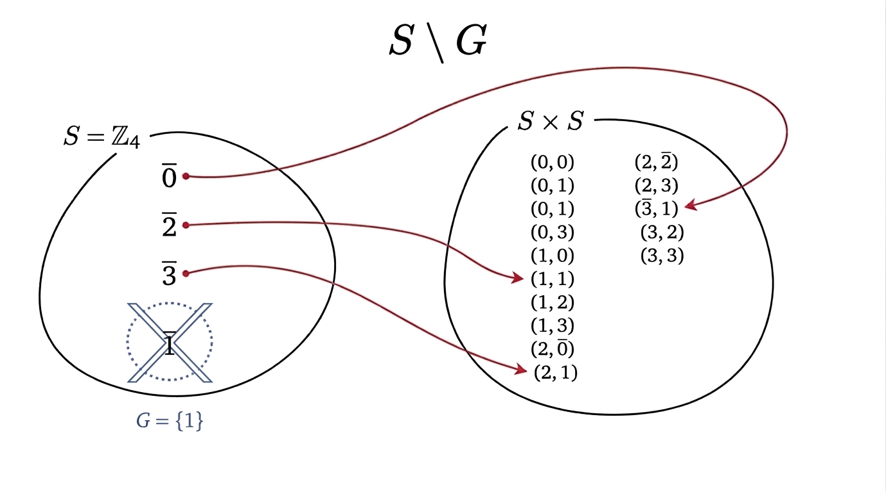
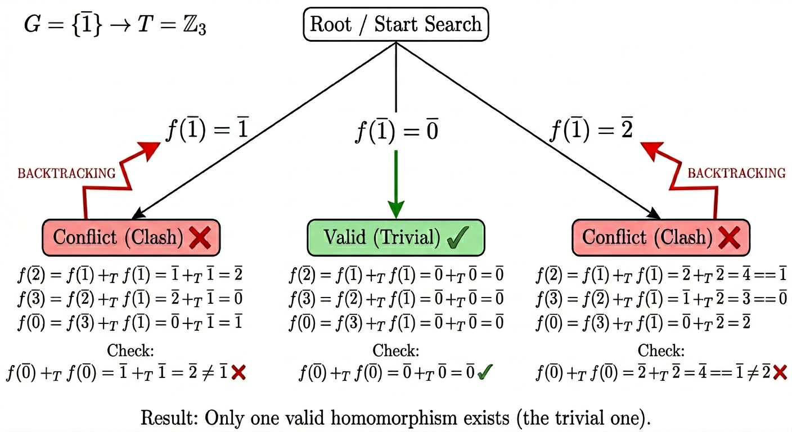

# Teoria: MorphFinder

MorphFinder è una libreria per trovare e classificare omomorfismi tra strutture algebriche finite, tra cui: magmi,
semigruppi, monoidi, gruppi, gruppi abeliani, anelli, anelli commutativi, anelli unitari, campi.

## Background teorico

Date due strutture algebriche $(S,*)$ e $(T,\square)$, si vuole determinare l'insieme degli omomorfismi da S a T ovvero

$$
\mathcal{Hom}(S,T) := \lbrace f: S \to T\ \text{s.t.}\ \forall a,b \in S\ f(a*b) = f(a)\ \square\ f(b) \rbrace
$$

Si nota facilmente che $|\mathcal{Hom}(S,T)| \le |Map(S,T)| = |T|^{|S|}$, dove $Map(S,T)$ rappresenta l'insieme delle
applicazioni da $S$ a $T$.

Un algoritmo che ricerca esaustivamente tutti i possibili omomorfismi da $S$ a $T$ impiegherebbe tempo esponenziale,
ovvero $O(|T|^{|S|})$. Se riuscissimo a trovare un sistema di generatori $G$ per $S$, allora ridurremmo lo spazio di
ricerca da $O(|T|^{|S|})$ a $O(|T|^{|G|})$, con $|G| \ll |S|$.

## Come determinare un sistema di generatori $G$ per $S$?

Per determinare un sistema di generatori $G$ per $S$ ho diverse strategie:

- Algoritmo a forza bruta: determina il sistema minimale di generatori $G$ di una struttura algebrica $S$ enumerando
  tutti i sottoinsiemi di $S$ in ordine di cardinalità crescente e restituendo il primo sottoinsieme $G \subseteq S$
  tale che $\langle G \rangle = S$, cioè tale che la chiusura di G rispetto alle operazioni (e costanti) della struttura
  coincida con l'intera struttura $S$. Garantisce di trovare l'insieme di cardinalità minima globale.

- Algoritmo greedy: costruisce un insieme di generatori $G$ che aggiunge iterativamente l'elemento che massimizza l'
  incremento della chiusura $\langle G \rangle$ fino a coprire tutta la struttura $S$, e successivamente rimuove gli
  elementi ridondanti ottenendo un insieme $G$ tale che $\langle G \rangle = S$ e nessun suo sottoinsieme proprio genera
  ancora $S$, senza però garantire che $G$ sia di cardinalità minima globale.

## Come determinare $\mathcal{Hom}(S,T)$?

Ci sono alcune considerazioni importanti da fare: innanzitutto non è detto che il sistema di generatori $G$ sia chiuso
rispetto all'operazione, ovvero non è detto che $\forall a,b \in G\ a * b \in G$. Anzi, essendo $|G| \ll |S|$ è molto
probabile che $\exists a,b \in G\ \text{s.t.}\ a * b \in S \setminus G$.

Poiché $G$ genera $S$, ogni omomorfismo $f \in \mathcal{Hom}(S,T)$ è univocamente determinato dalla sua
restrizione $f|_G : G \to T$. È quindi sufficiente enumerare le $|T|^{|G|}$ applicazioni nella forma $\varphi: G \to T$,
estendere ciascuna a $f: S \to T$ tramite la funzione di genealogia $h$ (descritta di seguito), e verificare
se $f \in \mathcal{Hom}(S,T)$.

### Funzione di genealogia

L'algoritmo costruisce una funzione $h: S \setminus G \to S \times S$ che associa a ciascun
elemento $x \in S \setminus G$ una coppia $(a, b) \in S \times S$ tale che $a * b = x$, tracciando così la "genealogia"
di ogni elemento non-generatore.

Consideriamo ad esempio i seguenti monoidi $S = (\mathbb{Z}_4, +, \bar{0})$ e $T = (\mathbb{Z}_3, +, \bar{0})$
dove $+: S \times S \to S$ denota l'usuale operazione binaria di somma. Determinato $G_S = \lbrace \bar{1} \rbrace$, si
ha che $h(\bar{0}) = (\bar{3}, \bar{1})$, $h(\bar{2})= (\bar{1}, \bar{1})$, $h(\bar{3}) = (\bar{2}, \bar{1})$ non
essendo necessario calcolare $h(\bar{1})$ poiché $\bar{1} \in G$.

La seguente Figura mostra la mappa di genealogia $h$:

### Backtracking e propagazione dei vincoli

Per costruire $\mathcal{Hom}(S,T)$, l'algoritmo inizia assegnando sistematicamente un valore in $T$ per ogni generatore
in $G$. A questo punto entra in gioco la funzione $h$. L'algoritmo usa questa funzione come "ricettario" per costruire
le immagini degli altri elementi di $S$, senza esplorare ulteriori assegnazioni candidate: se $h(x) = (a, b)$,
allora $f(x) := f(a)\ \square\ f(b)$. Costruito un possibile candidato $f$, si verifica che esso soddisfi la definizione
di omomorfismo su tutto $S \times S$ e che preservi le eventuali proprietà intrinseche delle strutture algebriche
fornite (come zero ed unità). Se si ottiene una contraddizione, $f$ viene scartato. Se il controllo ha successo, la
funzione trovata è un omomorfismo valido da $S$ a $T$.

Riprendendo l'esempio precedente, l'algoritmo assegna sistematicamente un elemento $b \in \mathbb{Z}_3$ a $g \in G$.

Caso per $f(\bar{1}) = \bar{1}$. Si ha che:

$h(\bar{2}) = (\bar{1}, \bar{1}) \implies f(\bar{2}) = f(\bar{1}) +_T f(\bar{1}) = \bar{1} + \bar{1} = \bar{2}$

$h(\bar{3}) = (\bar{2}, \bar{1}) \implies f(\bar{3}) = f(\bar{2}) +_T f(\bar{1}) = \bar{2} + \bar{1} = \bar{0}$

$h(\bar{0}) = (\bar{3}, \bar{1}) \implies f(\bar{0}) = f(\bar{3}) +_T f(\bar{1}) = \bar{0} + \bar{1} = \bar{1}$

Quindi l'applicazione $f$ costruita è

$$f: \mathbb{Z}_4 \to \mathbb{Z}_3$$
$$\bar{0} \mapsto \bar{1}$$
$$\bar{1} \mapsto \bar{1}$$
$$\bar{2} \mapsto \bar{2}$$
$$\bar{3} \mapsto \bar{0}$$

La funzione $f$ preserva l'operazione su tutto $S \times S$. Ma essendo le due strutture date dei monoidi, occorre
che $f$ preservi anche l'esistenza dell'elemento neutro ovvero $f(\varepsilon_S) = \varepsilon_T$
ma $f(\bar{0}) = \bar{0} \ne \bar{1}$ ottenendo una contraddizione. Quindi $f \notin \mathcal{Hom}(S,T)$.

A questo punto l'algoritmo esegue un backtracking e prova un'altra assegnazione possibile. Ad
esempio, $f(\bar{1}) = \bar{0}$.

Caso per $f(\bar{1}) = \bar{0}$. Si ha che:

$h(\bar{2}) = (\bar{1}, \bar{1}) \implies f(\bar{2}) = f(\bar{1}) +_T f(\bar{1}) = \bar{0} + \bar{0} = \bar{0}$

$h(\bar{3}) = (\bar{2}, \bar{1}) \implies f(\bar{3}) = f(\bar{2}) +_T f(\bar{1}) = \bar{0} + \bar{0} = \bar{0}$

$h(\bar{0}) = (\bar{3}, \bar{1}) \implies f(\bar{0}) = f(\bar{3}) +_T f(\bar{1}) = \bar{0} + \bar{0} = \bar{0}$

Quindi l'applicazione $f$ costruita è

$$f: \bar{a} \in \mathbb{Z}_4 \mapsto \bar{0} \in \mathbb{Z}_3$$

La funzione $f$ soddisfa la definizione di omomorfismo su tutto $S \times S$ e preserva l'elemento
neutro: $f(\varepsilon_S) = \varepsilon_T \iff f(\bar{0}) = \bar{0}$, vero. Quindi $f \in \mathcal{Hom}(S,T)$. In
particolare si tratta di un omomorfismo banale.

Proseguiamo con l'ultima assegnazione possibile, ovvero $f(\bar{1}) = \bar{2}$. Similmente a quanto fatto prima si
ottiene la seguente applicazione:

$$f: \mathbb{Z}_4 \to \mathbb{Z}_3$$
$$\bar{0} \mapsto \bar{2}$$
$$\bar{1} \mapsto \bar{2}$$
$$\bar{2} \mapsto \bar{1}$$
$$\bar{3} \mapsto \bar{0}$$

Verifico se tale applicazione preserva l'elemento neutro
ovvero $f(\varepsilon_S) = \varepsilon_T \iff f(\bar{0}) = \bar{0}$, falso. Quindi $f \notin \mathcal{Hom}(S,T)$.

$$
\therefore \mathcal{Hom}(S,T) = \lbrace f: \bar{a} \in \mathbb{Z}_4 \mapsto \bar{0} \in \mathbb{Z}_3 \rbrace
$$

La seguente Figura mostra l'albero di computazione per l'esempio fornito:

Si noti che grazie alla propagazione dei vincoli, l'algoritmo evita l'esplorazione esaustiva dell'intero spazio delle
applicazioni $(|T|^{|S|} = 3^4 = 81)$. Limitando i tentativi alla sola scelta delle immagini dei
generatori $(|T|^{|G|} = 3)$ il carico computazionale viene abbattuto, rendendo trattabili anche strutture algebriche di
dimensioni superiori.

## Classificare un omomorfismo

Una volta ottenuto $\mathcal{Hom}(S,T)$ tramite l'algoritmo CSP, MorphFinder classifica ogni
omomorfismo $f \in \mathcal{Hom}(S,T)$ analizzandone le proprietà categoriali.

### Primo teorema di isomorfismo

Il sistema sfrutta i principi del primo teorema di isomorfismo per classificare $f$. Per strutture come gruppi e anelli, il teorema afferma che:

$$
S/\ker(f) \cong \mathrm{Im}(f)
$$

Dove:

- $\ker(f) := \lbrace s \in S : f(s) = 0_T \rbrace$ è il nucleo di $f$.
- $\mathrm{Im}(f) := \lbrace f(s) \in T : s \in S \rbrace$ è l'immagine di $f$.
- $S/\ker(f)$ è l'insieme quoziente.

In questi casi (grazie al teorema di Lagrange per i gruppi), vale la relazione:

$$
|\mathrm{Im}(f)| = \frac{|S|}{|\ker(f)|}
$$

Nota: Per strutture più generali (come magmi o semigruppi) che non possiedono necessariamente un elemento neutro che
caratterizzi il nucleo, MorphFinder utilizza la relazione di congruenza $\sim_f$ definita
da $a \sim_f b \iff f(a) = f(b)$. In tal caso, $|\mathrm{Im}(f)|$ corrisponde al numero di classi di equivalenza
distinte in $S/{\sim_f}$, e l'iniettività coincide con la banalità di tutte le classi (ciascuna di cardinalità 1).

L'idea alla base è che il quoziente "pulisce" il dominio dalla ridondanza causata dalla non-iniettività. MorphFinder
ottimizza la classificazione confrontando le cardinalità dell'immagine e del codominio per identificare velocemente
monomorfismi ed epimorfismi.

### Criteri di classificazione

MorphFinder categorizza un omomorfismo $f: S \to T$ basandosi sulle proprietà derivate dall'analisi dell'immagine, del
nucleo e della natura degli insiemi coinvolti:

| Proprietà   | Simbolo                     | Condizione                                                                                                                     | 
|-------------|-----------------------------|--------------------------------------------------------------------------------------------------------------------------------|
| Monomorfismo | $f: S \hookrightarrow T$    | $f$ iniettiva: tutte le classi di $\sim_f$ sono banali; equivalentemente, per gruppi e anelli, $\ker(f) = \lbrace 0_S \rbrace$ |
| Epimorfismo | $f: S \twoheadrightarrow T$ | $f$ suriettiva: $\mathrm{Im}(f) = T$                                                                                           |
| Isomorfismo | $f: S \cong T$              | $f$ biiettiva: iniettiva + suriettiva                                                                                          |
| *Endomorfismo* | $f: S \to S$                | Dominio e codominio coincidono ($S = T$)                                                                                       |
| Automorfismo | $f: S \cong S$              | Isomorfismo con $S = T$                                                                                                        |

Oltre alla distinzione classica tra iniettività e suriettività, MorphFinder identifica se una struttura viene mappata in
se stessa (**Endomorfismo**). Se tale mappatura preserva perfettamente tutte le relazioni ed è biunivoca, si parla di *
*Automorfismo**, che rappresenta una simmetria strutturale dell'algebra stessa.

Ad esempio, consideriamo $f: \bar{a} \in \mathbb{Z}_6 \mapsto \bar{2a} \in \mathbb{Z}_4$.

- $\ker(f) = \lbrace \bar{0}, \bar{2}, \bar{4} \rbrace$. Poiché $\ker(f) \ne \lbrace \bar{0} \rbrace$, $f$ non è
  iniettiva.
- $\mathrm{Im}(f) = \lbrace \bar{0}, \bar{2} \rbrace$. Poiché $\mathrm{Im}(f) \ne \mathbb{Z}_4$, $f$ non è suriettiva.

Quindi $f$ non è né un monomorfismo, né un epimorfismo (e di conseguenza non è un isomorfismo).

Facciamo un altro esempio e consideriamo $f: \bar{a} \in \mathbb{Z}_3 \mapsto \bar{2a} \in \mathbb{Z}_3$.

- $\ker(f) = \lbrace \bar{0} \rbrace$. Poiché $\ker(f) = \lbrace \bar{0} \rbrace$, $f$ è iniettiva.
- $\mathrm{Im}(f) = \lbrace \bar{0}, \bar{1}, \bar{2} \rbrace$. Poiché $\mathrm{Im}(f) = \mathbb{Z}_3$, $f$ è
  suriettiva.

In questo caso, essendo $f$ un isomorfismo tra la struttura $\mathbb{Z}_3$ e se stessa, viene classificato come
isomorfismo, endomorfismo e automorfismo. In particolare, $f$ rappresenta una simmetria non banale di $\mathbb{Z}_3$: si
può verificare che $\mathrm{Aut}(\mathbb{Z}_3) \cong \mathbb{Z}_2$, confermando l'esistenza di esattamente un
automorfismo non banale.
